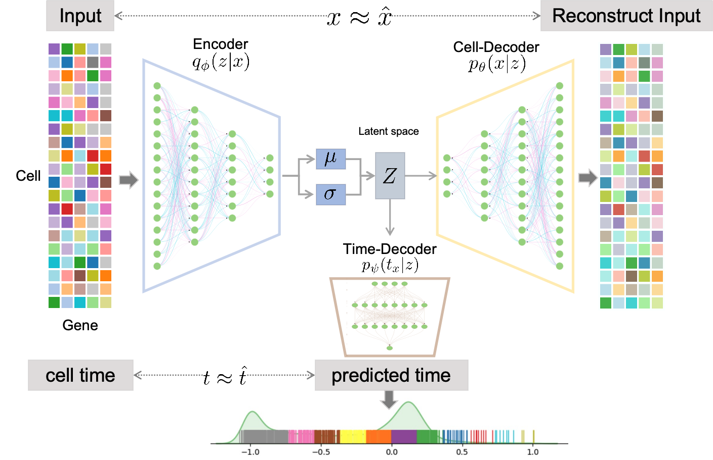

[//]: # (<div align="center">)

[//]: # (    )

[//]: # (</div>)

# StemVAE: identify temporal information from endometrium cells via Deep generative model

[](https://opensource.org/license/mit/) 

Contact: Yuanhua Huang, Dandan Cao, Yijun Liu

Email:  yuanhua@hku.hk.

## Introduction ()
StemVAE use the probabilistic latent space model to infer the pseudo-time of cells. StemVAE input consists of an mRNA expression matrix and real-time labels of cells, and output is the reconstruction of the expression matrix and predicted time. StemVAE, based on canonical variation atuo-encoder (VAE), includes an encoder, a cell-decoder, and a time-decoder. 

[//]: # (A preprint describing StemVAE's algorithms and results is at [bioRxiv]&#40;https://;.)




---


## Contents

- [Latest Updates](#latest-updates)
- [Installations](#installation)
- [Usage](#usage)
    - [Model training](#model-training)
    - [Performance evaluation](#performance-evaluation)
    - [Spatial inference](#spatial-inference)
   

## Latest Updates
* v0.1 (Sep, 2023): Initial release.
---
## Installation
To install stemVAE, python 3.9 is required and follow the instruction
1. Install <a href="https://docs.conda.io/projects/miniconda/en/latest/" target="_blank">Miniconda3</a> if not already available.
2. Clone this repository:
```bash
  git clone https://github.com/awa121/stemVAE_endometrium
```
3. Navigate to `stemVAE_endometrium` directory:
```bash
  cd stemVAE_endometrium
```
4. (5-10 minutes) Create a conda environment with the required dependencies:
```bash
  conda env create -f environment.yml
```
5. Activate the `stemVAE` environment you just created:
```bash
  conda activate stemVAE
```
6. Install **pytorch**: You may refer to [pytorch installtion](https://pytorch.org/get-started/locally/) as needed. For example, the command of installing a **cpu-only** pytorch is:
```bash
conda install pytorch torchvision torchaudio cpuonly -c pytorch
```

## Usage


StemVAE contains 2 main function: k fold test on dataset; predict on a new donor. And we also provide code to reproduce the result in the paper. 

To check available modules, run:
### prepare the preprocess data:
_Todo list_
### k fold test
The result will save to folder _results_, log file wile save to folder _logs_
```bash
python -u VAE_fromDandan_testOnOneDonor.py 
--vae_param_file=supervise_vae_regressionclfdecoder 
--file_path=preprocess_02_major_Anno0717_Gene0720 --time_standard_type=neg1to1 
--train_epoch_num=100 
--result_save_path=230728_newAnno0717_Gene0720_18donor_2type_plot 
> logs/log.log


```


